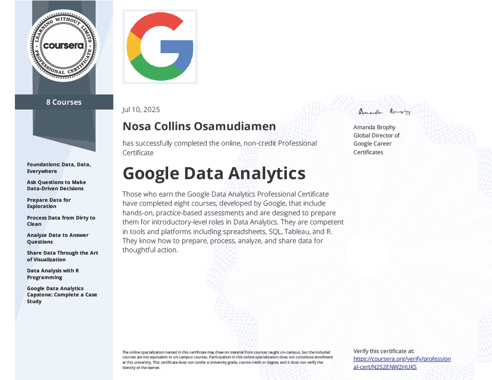
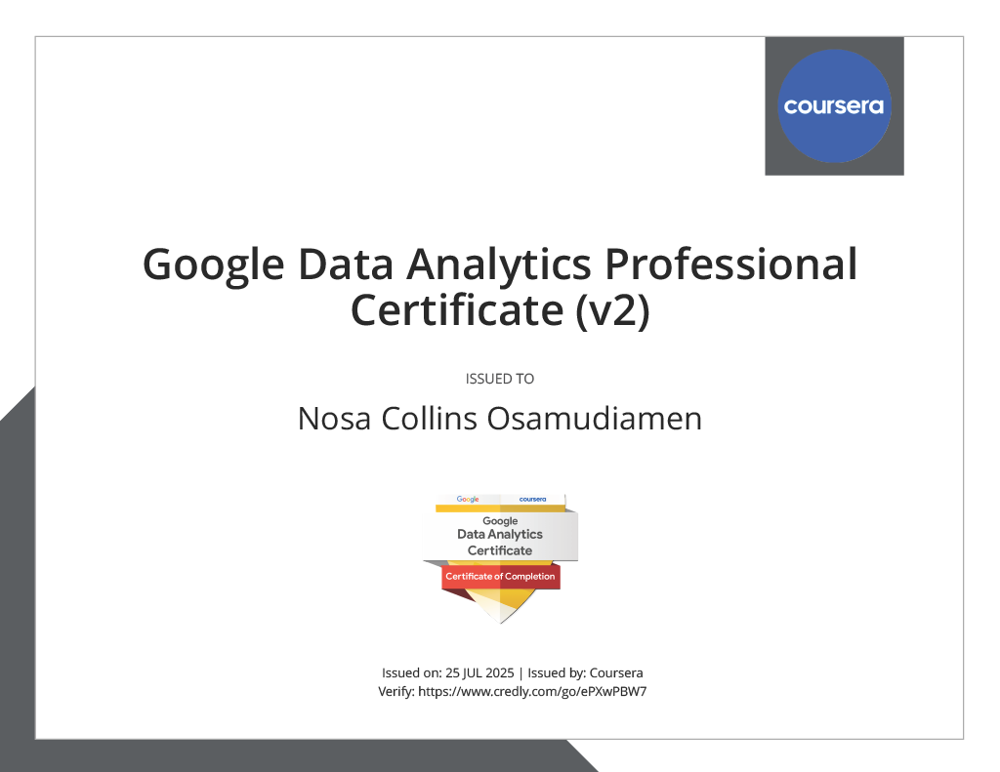

# Google Data Analytics Professional Certificate Capstone Project - Cyclistic bike-share

This is the capstone project of the **Google Data Analytics Professional Certificate** offered by Coursera. The goal of this project is to help Cyclistic, a bike-share company in Chicago, understand how its customers use its service differently depending on whether they are annual members or casual riders.

## Project Title: Cyclistic – How Does a Bike-Share Company Navigate Speedy Success?

## Background

Cyclistic is a bike-share program that includes more than 5,800 bicycles and 600 docking stations. It offers different types of bikes including reclining bikes, hand tricycles, and cargo bikes. Most riders use traditional bikes, and about 30% use the service to commute to work.

The Director of Marketing, Lily Moreno, wants to find ways to encourage more casual riders to become annual members. To support this goal, the team needs to understand how casual riders and members behave differently when using Cyclistic bikes.

## Business Task

Analyze how annual members and casual riders use Cyclistic differently and provide insights to help convert more casual riders into annual members.

## Tools Used

- SQL (SQLite) for data data merging.
- R (tidyverse, lubridate, dplyr, janitor, readr, ggplot2) for data cleaning, preparation, analysis and visualization

## Data Source

The data was taken from the [Divvy Bike Share System](https://divvy-tripdata.s3.amazonaws.com/index.html). It includes 12 months of ride history from July 2023 to June 2024.

## Key Findings

- Casual riders take longer rides on average
- Members ride more often during the week
- Casual riders mostly use Cyclistic on weekends
- Casual riders tend to ride more during summer months

## Recommendations

- Offer weekend membership trials to casual riders
- Promote memberships at high-traffic stations
- Emphasize savings and benefits of being a member through in-app and email campaigns

## Outputs

All visualizations and cleaned data are included in the outputs and data folders in this repository.

## Certificate of Completion

This project was completed as part of the **Google Data Analytics Professional Certificate**

 

 