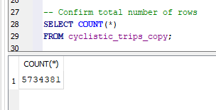
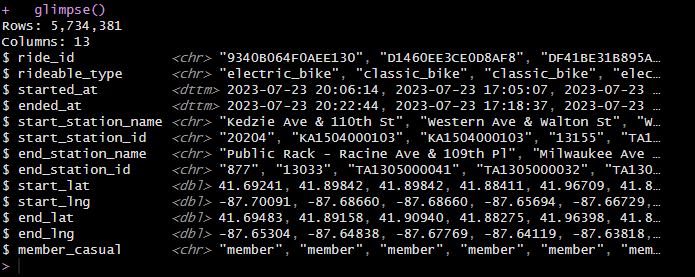

# Case Study: How does a bike-share company navigate speedy success

**Author:** Collins Nosa
**Date:** 2025-06-07

## Background

Cyclistic is a Chicago-based bike-share program with over 5,800 bikes and 600 docking stations. Since 2016, it has offered flexible pricing options, including single-ride, full-day, and annual memberships.

The company is shifting focus from general brand awareness to increasing profitability through long-term user retention. Believing that annual members are more valuable, Cyclistic aims to convert existing casual riders into members.

To support this strategy, the marketing team needs to understand how usage patterns differ between the two rider types. Analyzing 12 months of trip data will uncover insights to guide targeted campaigns and drive membership growth.

### This project aims to:

* Explore and compare the riding behaviors of casual riders versus annual members.
* Identify patterns related to ride duration, day of the week, and frequency of use.
* Deliver data-driven recommendations that support marketing strategies to grow the annual membership base.

 The insights from this analysis will directly inform marketing decisions and guide Cyclistic’s efforts in increasing member conversion.

# Step 1: Task Requirements

### Business Task

Determine how annual members and casual riders use Cyclistic bikes differently, so the marketing team can design strategies to convert more casual riders into annual members.

### Stakeholders

**Primary:** Lily Moreno, Director of Marketing – Leads the marketing initiative and oversees the analysis.

**Secondary:** Cyclistic Executive Team – Reviews and approves the proposed marketing program based on the analysis.


### Problem Statement
Cyclistic wants to convert casual riders into annual members to increase long-term revenue. The core problem is a lack of understanding regarding the behavioral differences between these two groups. By analyzing a year of trip data, this project aims to identify key patterns that will inform and support a new, data-driven marketing campaign designed to boost annual memberships.

# Step 2: Data Acquisition and Preparation

### Data & Source Integrity

To complete this analysis, 12 months (July 2023 – June 2024) of historical trip data collected by the Cyclistic bike-share program in Chicago was used. The data was made publicly available by Motivate International Inc., the service provider for Divvy (which Cyclistic is modeled after). These datasets are available at [divvy-tripdata.](https://divvy-tripdata.s3.amazonaws.com/index.html)

### Observations

Each monthly dataset is provided as a .csv file and includes millions of records of individual bike rides. The key columns used for this analysis include:

* **ride_id:** Unique identifier for each ride

* **rideable_type:** Type of bike used (e.g., classic, docked, or electric)

* **started_at and ended_at:** Timestamps for trip start and end

* **start_station_name and end_station_name:** Names of stations

* **member_casual:** Rider type (either "member" or "casual")

Note: Riders’ personally identifiable information (PII) is not included, in compliance with data privacy regulations. This Data is protected under data-privacy license mentioned [here](https://divvybikes.com/data-license-agreement)

The datasets were downloaded as .zip files, extracted, and consolidated for cleaning and analysis.

# Step 3: Processing Data (Cleaning and Transformation)

### Tools Used:  

* DB Browser for SQLite
* R studio

### Cleaning and Transforming the Data

The ride data from the past 12 months was originally stored separately by month. To make things easier to manage and analyze, all the files were combined into one table called cyclistic_trips.

After merging, a working copy of the table was created (cyclistic_trips_copy), and the COUNT() function was used to check the total number of rows in the dataset. The dataset was then exported to .csv, revealing 5,734,381 records in total.

```{sql eval=FALSE, include=FALSE}

-- create a working copy of cyclistic_trips
CREATE TABLE cyclistic_trips_copy AS
SELECT * 
FROM cyclistic_trips;

-- Confirm total number of rows
SELECT COUNT(*)
FROM cyclistic_trips_copy
```


To prepare the data for analysis, incomplete or incorrect records were removed, and consistent formatting was applied throughout the dataset using RStudio.

Next, new useful columns were created:

* **ride_length:** how long each ride lasted, in minutes
It helps us compare how long casual riders vs. members use the bikes in minutes.

* **day_of_week:** uncover riding patterns across weekdays vs. weekends. (Sunday to Saturday).

* **month:** to analyze seasonal trends in order to target marketing campaigns around peak months.

The procedures mentioned above are shown below

### Importing Necessary Libraries

```{r Importing libraries, message=FALSE, warning=FALSE}
library(readr)
library(dplyr)
library(janitor)
library(lubridate)
library(tidyverse) 
library(ggplot2)
```
###  Loading the .csv dataset and a glimpse at the dataframe

```{r Loading the .csv Dataset and a Glimpse at the Dataframe}
df <- read_csv("data/cyclistic_data.csv")

df <- df %>% 
  glimpse()
```
 

###  Cleaning of Invalid Timestamps
```{r Cleaning of Invalid Timestamps}
df <- df %>%
  filter(!is.na(ymd_hms(started_at)))
```

### Converting started_at and ended_at to datetime objects
```{r Convert started_at and ended_at to datetime objects}
 df <- df %>%
  mutate(
    started_at = ymd_hms(started_at),
    ended_at = ymd_hms(ended_at)
  )
```

### Creating ride_length
```{r Creating ride_length}
 # Creating ride_length
df <- df %>%
    mutate(ride_length = round(as.numeric(difftime(ended_at, started_at, units = "mins")), 2)))
  )

# Filtering rides longer than 1 day (1440 minutes)
df %>% filter(ride_length > 1440) 

# keep rides between 0 and 1 day
df <- df %>% filter(ride_length > 0 & ride_length < 1440)  
```

### Creating day_of_week column (Sunday to Saturday)
```{r Creating day_of_week column (Sunday to Saturday)}
df <- df %>%
  mutate(day_of_week = wday(started_at, label = TRUE, abbr = FALSE))
```

### Extracting and ordering the month from a timestamp column
```{r Extracting and ordering the month from a timestamp column}
df <- df %>%
  mutate(month = format(started_at, "%B"),
         month = factor(month, levels = month.name)) 
``` 

### Taking a glimpse to see the new columns (ride_length, day_of_week, month)
```{r aking a glimpse to see the new columns (ride_length, day_of_week, and month)}
df <- df %>% 
  glimpse(df)
```
 

# Step 4: Analysis

### Ride Count by Rider Type
```{r Ride Count by Rider Type}
df %>%
  count(member_casual) %>%
  ggplot(aes(x = member_casual, y = n, fill = member_casual)) +
  geom_col() +
  labs(title = "Total Rides by Rider Type", x = "Rider Type", y = "Number of Rides") +
  theme_minimal()
```


This chart compares the total number of rides taken by casual riders and members over the last 12 months. It shows that annual members take significantly more rides than casual riders.


### Monthly Ride Counts by Rider Type
```{r Monthly Ride Counts by Rider Type}
df %>%
  count(member_casual, month) %>%
  ggplot(aes(x = month, y = n, fill = member_casual)) +
  geom_col(position = "dodge") +
  labs(title = "Monthly Ride Counts by Rider Type", x = "Month", y = "Number of Rides", fill = "Rider Type") +
  theme_minimal() +
  theme(axis.text.x = element_text(angle = 45, hjust = 1))
```


Casual riders have noticeable peaks in the summer months (especially June to August), while members maintain a steady usage throughout the year. This pattern suggests that casual riders are more seasonal users, likely riding for leisure, while members ride more consistently, often for commuting or regular travel.

### Average Ride Duration by Rider Type
```{r Average Ride Duration by Rider Type}
df %>%
  group_by(member_casual) %>%
  summarize(avg_ride = mean(ride_length), .groups = "drop") %>%
  ggplot(aes(x = member_casual, y = avg_ride, fill = member_casual)) +
  geom_col() +
  labs(title = "Average Ride Duration by Rider Type", x = "Rider Type", y = "Avg Ride Length (minutes)") +
  theme_minimal()
```


This chart shows that casual riders take longer rides on average compared to annual members. This suggests casual users may be riding for leisure or exploration, while members likely use Cyclistic bikes for shorter, routine trips, such as commuting.


### Ride Frequency by Day of Week
```{r Ride Frequency by Day of Week}
df %>%
  count(member_casual, day_of_week) %>%
  ggplot(aes(x = day_of_week, y = n, fill = member_casual)) +
  geom_col(position = "dodge") +
  labs(title = "Ride Frequency by Day of Week", x = "Day", y = "Number of Rides") +
  theme_minimal()
```


This chart shows how ride frequency varies across the week for both rider types. Casual riders take more rides on weekends, especially Saturday and Sunday, while members ride more consistently on weekdays.

### Average Ride Duration by Day of Week
```{r Average Ride Duration by Day of Week}
df %>%
  group_by(member_casual, day_of_week) %>%
  summarize(avg_duration = mean(ride_length), .groups = "drop") %>%
  ggplot(aes(x = day_of_week, y = avg_duration, fill = member_casual)) +
  geom_col(position = "dodge") +
  labs(title = "Average Ride Duration by Day of Week", x = "Day", y = "Avg. Ride Length (min)") +
  theme_minimal()
```


This chart shows that casual riders consistently take longer rides than members across all days of the week, especially on weekends. In contrast, members maintain shorter ride durations, suggesting more purposeful or routine use.

### Rides by Rider Type and Bike Type
```{r Rides by Rider Type and Bike Type}
df %>%
  count(member_casual, rideable_type) %>%
  ggplot(aes(x = rideable_type, y = n, fill = member_casual)) +
  geom_col(position = "dodge") +
  labs(title = "Rides by Bike Type and Rider Type", x = "Bike Type", y = "Number of Rides") +
  theme_minimal()
```


This chart compares how different rider types use Cyclistic’s bike options. It shows that both members and casual riders prefer classic bikes, but casual riders use electric bikes more frequently than members.

# Summarizing Findings

After analyzing the last 12 months of Cyclistic bike-share data, several key patterns emerged that highlight how casual riders and annual members use the service differently:

1. **Ride Duration:** 
   Casual riders tend to take significantly longer rides than members. This suggests that casual users are more likely riding for leisure or tourism, while members may be using the bikes for quick commutes or errands.

2. **Usage by Day of the Week:**
   Casual riders are most active on weekends, especially Saturdays and Sundays. In contrast, members ride more consistently throughout the work week, peaking on weekdays, which supports the idea that members use bikes more for routine travel.

3. **Ride Volume:**
   While members have a higher overall number of rides, casual riders show strong seasonal and weekend usage patterns. This indicates potential for targeted engagement during these high-activity times.


# Recommendations

Based on the analysis, here are three actionable steps Cyclistic could take to encourage more casual riders to become members:

1. **Launch a Weekend Membership Trial:**
   Offer discounted or short-term memberships that are valid primarily on weekends. This would appeal to casual riders who are already active on Saturdays and Sundays and help introduce them to the benefits of membership.

2. **Promote Membership at High-Traffic Stations:**
   Use digital ads or station-based promotions at popular weekend start/end locations to target casual riders where they’re most engaged.

3. **Highlight Cost Savings for Frequent Riders:**
   Use email or app notifications to inform casual riders who frequently use the service (especially those with longer rides) about how much they could save by switching to an annual membership.


 # Conclusion

This analysis really sheds light on the different habits of Cyclistic's casual riders and their annual members. Knowing when, how, and why casual riders use the service lets us create smarter, more focused marketing campaigns.


By using data to tailor our messages to casual riders' habits, we have a great chance to turn those one-time users into loyal, long-term members and boost our overall user retention.


